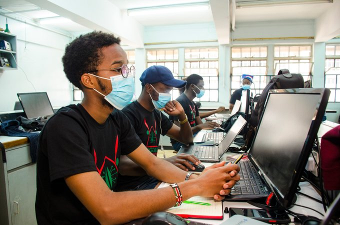

  <h1 align="center">Hi 👋, I'm Sam Waweru</h1>

  <h3 align="center">A passionate Python and ML developer and a Mechatronics Engineering Undergraduate at JKUAT</h3>

  <h3 align="center"> Interests : Robotics and AI Research </h3>
   
  
   

  <h3 align="center">Connect with me:</h3>
  

  
  
  
  

  <h3 align="center">Languages and Tools:</h3>
  
              

  
  

    
  

</body>
