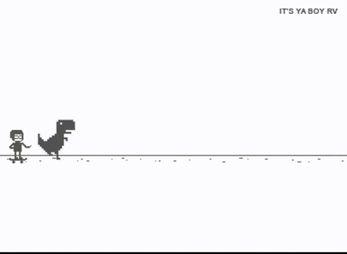

  ```python
  #!/usr/bin/env python3
  # ── github.com/samkamau81 ──────────────────────────────────────────────────
  # This README renders as code but tells you who I am and what I'm building.
  
  from dataclasses import dataclass
  
  @dataclass
  class Dev:
      name: str = "Samwel Waweru"
      location: str = "Nairobi, Kenya"
      focus: tuple = ("Edge AI", "Computer Vision", "NLP", "Systems ML", "Customer Management")
      toolbox: tuple = ("Python", "C/C++", "Tensorflow", "PyTorch/YOLO",
                        "Raspberry Pi", "Arduino", "AWS")
  
      motto: str = "Always learning. Always building."
```
<p align="center">

</p>

  ```python
  me = Dev()
  
  print(f"Hi, I'm {me.name} — I build intelligent business systems.")
  print(f"Focus       : {', '.join(me.focus)}")
  print(f"Toolbox     : {', '.join(me.toolbox)}")
  print(f"{me.motto}")
  ```  


