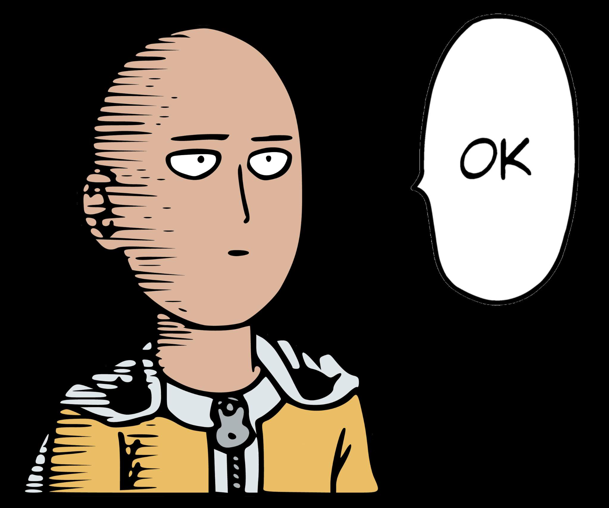

<!DOCTYPE HTML>
<html>
<head>
  <meta charset="utf-8">
  <meta name="viewport" content="width=device-width, initial-scale=1.0"> 
  </head>
 
<body> 
  <h1 align="center">Ola👋 </h1>
  <h2 align="center">I'm Sam</h2>
  <h3 align="center"> Hobbies : Karate🐱‍👤, Literature🎭 , Electronic Engineering⚡ , Software Engineering💸 </h3>
  <h3 align="center"> Interests : Software Development , AI Research , Backend Development </h3>
 
                    
  

      
  

  

   

  <h3 align="center">Connect with me:</h3>
  

  
  
  

  <h3 align="center">Languages and Tools:</h3>
  
              

 
    

    
</body>
</html>

